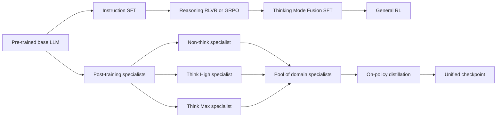
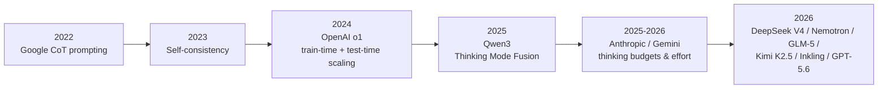

# Sebastian Raschka《Controlling Reasoning Effort in LLMs》資訊圖嚴謹分析報告

## 執行摘要

這張題為 **「Controlling Reasoning Effort in LLMs」**、署名 Sebastian Raschka、日期為 **2026 年 7 月 18 日** 的資訊圖，實際上不是在介紹某一個單一模型的官方訓練流程，而是把多篇技術報告與產品介面整合成一張「方法地圖」：上方的 effort/UI 與成本曲線對應 GPT-5.6 與 Artificial Analysis；中段的 **Thinking Mode Fusion** 對應 Qwen3；右側的 **Non-think / Think High / Think Max + specialist teachers + on-policy distillation** 對應 DeepSeek V4；下方的雷達圖對應 Kimi K2.5 的 **Toggle**；右下角的 proof-score 圖則對應 DeepSeekMath-V2 的 **self-consistency + self-refinement**。Raschka 在原文也明說，文章目標是說明「如何開發具有多種 effort 模式的 reasoning model」，並在後半段比較六個 open-weight 旗艦模型的公開做法，而不是還原某一家閉源模型的完整內部 recipe。citeturn4view0turn5view1turn7view0

就技術內容看，這張圖最核心的論點有三個。第一，**reasoning effort 不是單靠 prompt engineering 就能憑空產生的行為**；它通常需要在後訓練中，透過 SFT、RLVR/GRPO、模式融合、長度懲罰、budget-aware truncation、或 on-policy distillation 等機制讓模型「學會」不同思考深度。Qwen3、DeepSeek V4、Nemotron 3 Ultra、Kimi K2.5、GLM-5、Inkling 都各自公開了不同變體。citeturn19view0turn22view1turn20view1turn20view0turn20view2turn17view0

第二，**推理品質、token 用量、延遲與成本之間存在可控但非線性的 tradeoff**。OpenAI 的 reasoning docs 明確說明，`reasoning.effort` 會影響模型「想多久」，較低 effort 偏向速度與較少 token，較高 effort 則偏向更完整的推理與較高品質；Google DeepMind 的 Gemini 2.5 也把這件事表述成 thinking budget；Anthropic 則用 extended thinking / adaptive thinking 與 effort controls 來暴露類似控制面。citeturn15view1turn14view0turn14view1turn23view0turn23view1

第三，**圖中把「努力模式」與「測試時計算擴展」放在同一張圖上，是刻意強調兩種不同維度**：一種是模型本身在後訓練裡學會的模式切換；另一種是推理時額外疊加的算力策略，例如 self-consistency、多樣本 majority vote、self-refinement、多代理並行等。OpenAI 在 o1 文章中直接指出，o1 的表現會隨 **train-time compute** 與 **test-time compute** 同時平滑提升；Google 的 self-consistency 論文則證明，多路 reasoning path 再做一致性選擇，能顯著提升 CoT 表現。citeturn16view1turn14view4

## 關鍵發現

| 命題 | 結論 | 依據 |
|---|---|---|
| 這張圖是在描述單一模型嗎 | **不是**。它是 Raschka 對多個公開系統的合成解釋圖。 | 原文說明文章目標是解釋多 effort modes，並在後半段橫向比較六個 open-weight 模型。citeturn4view0turn5view1turn7view0 |
| effort mode 能否只靠 prompt 加一行「多想一點」得到 | **通常不行**。公開報告顯示它需要配合 mode-conditioned SFT、RL、budget control 或 distillation。 | Qwen3、DeepSeek V4、Nemotron 3 Ultra、Inkling 均如此。citeturn19view0turn22view1turn20view1turn17view0 |
| `<think>` 標記本身是否帶來推理能力 | **不是**。它主要是格式與界面分隔符。 | Raschka 明說 `<think>` token 對 reasoning ability 是 cosmetic；OpenAI 也建議不要額外用「think step by step」去硬提示 reasoning models。citeturn5view0turn15view2 |
| 高 effort 是否一定值得 | **不一定**。常見趨勢是品質上升但邊際報酬遞減。 | GPT-5.6 / AA、Inkling、Gemini thinking budgets 都呈現「更多 thinking 通常更好，但不是線性」。citeturn25view0turn17view0turn14view0 |
| Ultra 是否只是另一個更長的單模型 CoT | **不完全是**。在 GPT-5.6 的官方說法裡，`ultra` 是多代理並行協作設定，而不只是單一模型再多想一些。 | OpenAI GPT-5.6 launch post 與 API docs 對 effort levels 的定義不同。citeturn25view0turn25view1 |
| Token-efficient training 是否一定會損失能力 | **未必**。Kimi K2.5 的 Toggle 與 Nemotron 的 medium-effort 都試圖在保留質量的前提下降 token。 | Kimi K2.5 與 Nemotron 3 Ultra。citeturn20view0turn5view4 |

## 文章目標與模式框架

Raschka 原文的直接目標，是解釋 **「一個 reasoning model 如何學會低、中、高 effort 模式」**，也就是：同一組權重，如何在不同場景中切換成不思考、一般思考、深度思考、甚至超高 effort 的行為。這與早期「一個 base model、另一個 reasoning model」的雙模型分工不同；Qwen3、GLM-5、DeepSeek V4、Nemotron 3 Ultra 與 Inkling 代表的，是把這些模式逐步整合進單一 checkpoint 或單一對外介面。citeturn4view0turn6view3turn6view2turn22view1turn20view1turn17view0

就這張資訊圖本身來看，最值得把握的是：**它把至少兩條 pipeline 疊在一起**。左側是以 Qwen3 為代表的 **Pretrained base LLM → Instruction SFT → Reasoning RL → Thinking Mode Fusion SFT → General RL**；右側則是以 DeepSeek V4 為代表的 **先訓出不同 reasoning specialists 與 domain specialists，再透過 on-policy distillation 蒸餾成一個 unified checkpoint**。這正是圖中同時出現「Thinking Mode Fusion」與「Pool of >10 specialist teachers」的原因。citeturn6view3turn19view0turn22view1turn22view0

以下是依據圖像與原始來源整理出的**合成式簡化流程圖**。它是對這張 infographic 的最佳結構化重建，但**不是任何單一公司的官方流程圖**。citeturn19view0turn22view1turn20view1turn17view0

若把「reasoning effort」進一步拆成使用者實際會遇到的模式，可得到下表。表中有些列來自官方命名，有些則是 Raschka 為了比較不同系統而做的歸納；凡未公開的內部超參數，我都標為**未指定**。citeturn25view1turn23view1turn22view3turn20view0turn17view0

| 模式 | 典型 prompt / 控制面 | 訓練資料或後訓練機制 | 相對計算成本 | token 用量 | 性能增益 | 最佳使用情境 |
|---|---|---|---|---|---|---|
| **Non-think / reasoning-off** | `thinking: disabled`、prefill 空的 `<think></think>`、或 chat template 關閉 thinking。citeturn6view3turn18view0turn20view2 | 與 thinking 範例混合的 SFT；有些系統再用 general RL 強化格式遵循。citeturn19view0turn20view2 | 最低 | 最少 | 對簡單任務通常足夠；對難題明顯較弱。citeturn19view0turn22view4 | FAQ、分類、摘要、低風險 agent steps |
| **Think High / standard thinking** | 開啟 thinking；通常產生 `<think> ... </think>` 推理段。citeturn18view1turn22view3 | Long-CoT SFT + reasoning RL / RLVR。citeturn19view0turn22view1 | 中高 | 中高 | 較 non-think 明顯提升數學、程式、複雜推理。citeturn22view4turn16view1 | 複雜問答、規劃、一般 coding |
| **Think Max / xhigh / max** | 更高 effort；某些系統再加特製 system instruction。DeepSeek V4 的 Think Max 會插入強制徹底推理指令；OpenAI API 支援 `xhigh` / `max`。citeturn22view3turn25view1 | mode-conditioned RL，使用較長 context window 與較低 length penalty。citeturn22view1turn22view3 | 最高的單模型模式 | 最多 | 通常再增強品質，但邊際報酬遞減。citeturn25view0turn17view0turn14view0 | hardest math、hard coding、long-horizon planning |
| **Toggle / efficient mode** | 使用者未必看得到明確 selector；本質是訓練期 alternating RL，推理時往往仍是一個 thinking checkpoint。citeturn6view0turn20view0 | Budgeted RL 與 unconstrained RL 交替；budget 由正確 rollout 長度分位數估計。citeturn6view0turn20view0 | 中等 | 顯著下降 | Kimi 報告顯示平均可降約 25–30% tokens，性能幾乎不變。citeturn6view0turn20view0 | 高吞吐推理、想省 tokens 但不想明顯掉分 |
| **Continuous effort** | `effort ∈ [0,1]` 或類似連續值，而不是離散 low/medium/high。citeturn17view0 | 在 RL 階段把 effort 當條件輸入，並對每 token 成本做 effort-conditioned 調整。citeturn17view0 | 可細緻調節 | 可細緻調節 | 曲線通常平滑，但高 effort 區仍可能遞減。citeturn17view0turn14view0 | 需要 router 或動態 budget 的生產系統 |
| **Ultra / 多代理並行** | GPT-5.6 官方描述為多代理平行工作，不只是單一模型多想。citeturn25view0 | 產品/系統層級的多代理協作；不是單一 RL trace 長度控制而已。citeturn25view0 | 最高總成本，但可縮短 wall-clock | 總 token 最高 | 在 demanding tasks 上把 score-latency frontier 推高且左移。citeturn25view0 | 高價值長任務、並行研究、重型 coding/analysis |

這條演化脈絡也可用時間線快速理解：先是 Google 用 CoT 提示把「中間推理步驟」變成顯性技巧，再由 self-consistency 擴展為多路取樣；之後 OpenAI 把 train-time 與 test-time compute scaling 系統化；再往後，Qwen3、DeepSeek V4、GLM-5、Nemotron 3 Ultra、Kimi K2.5 與 Inkling 把「mode control」明確做進後訓練。citeturn14view3turn14view4turn16view1turn19view0turn22view1turn20view1turn17view0

## 圖像與圖表解析

這張資訊圖包含多個異質但互相關聯的視覺元件。下面我依出現順序逐一解析，並把可重建的座標、趨勢與含義拆開說明。若原圖數字過小、無法可靠辨識，我會明標 **未指定** 或 **目測近似值**。

**成本與 API 成本曲線。** 左上角圖的標題是 **「GPT-5.6 Sol on the Artificial Analysis Coding Agent Index v1.1」**，橫軸是 **API cost (USD)**，縱軸是 **Index score**，圖中以一條藍線展示 effort 提升後，分數隨成本上升而提高。Raschka 在原文對應圖說中指出：提升 reasoning effort 會同時推高 API 成本與 coding-agent 表現，但最高幾檔存在明顯**遞減報酬**。OpenAI 官方對 GPT-5.6 的描述也一致：`max` 比 `xhigh` 更願意花時間做 reasoning，而 `ultra` 更進一步用四個代理並行以換取更高表現或更短 time-to-result；同時 API docs 建議把 `max` 保留給最難、最品質優先的工作負載。citeturn6view4turn25view0turn25view1

根據你提供的圖面，我可做以下**目測近似重建**：

| effort 標籤 | 目測 API cost | 目測 index score | 備註 |
|---|---:|---:|---|
| None | 約 \$450 | 約 58–59 | 最低成本基線 |
| Low | 約 \$600 | 約 69 | 成本小增、分數大增 |
| Medium | 約 \$1,000 | 約 74–75 | 圖中最陡的一段之一 |
| High | 約 \$1,400 | 約 77–78 | 開始進入遞減 |
| XHigh | 約 \$1,800 | 約 78–79 | 增益縮小 |
| Max | 約 \$2,400–2,500 | 約 80 | 接近飽和 |
| Ultra | **未單獨繪點** | **未指定** | 圖中 menu 有 Ultra，但原文說 benchmark numbers 尚未公開，應接近 Max，因其使用相近 effort 並以四個 subagents 加速。citeturn4view0turn25view0 |

這張圖真正的啟示，不是「高 effort 永遠最好」，而是 **同一條曲線上存在一段很有價值的 Pareto 區間**：從 None → Low → Medium，花費增加，但分數成長相對划算；進入 High / XHigh / Max 之後，成本仍上升，但每一美元換到的額外 gain 顯著縮小。這與 Google 對 Gemini 2.5 Flash thinking budget 的敘述高度一致：更高 budget 容許更深入推理、改善品質，但模型不一定會把 budget 用滿，而且 budget 的價值取決於題目難度。citeturn14view0turn6view4

**Prompt 與 self-correction 範例。** 右上角的文字範例用一個「票價與爆米花總價」的算術題，展示 reasoning trace 中的 **自我糾錯**：模型先做出錯誤設置，再在 `<think>` 區塊內主動意識到「Wait, that can't be right」，接著修正方程。Raschka 在原文對 o1 的描述亦指出，RL 訓練讓模型學會辨識並修正自己的錯誤、把難步驟拆開、以及在目前路徑不通時改用其他方法。這與 OpenAI 對 o1 的官方總結相符。citeturn16view4

這個小範例的重要性不在於算術本身，而在於它把 reasoning model 與一般 instruction model 的差異視覺化：**重點不是末答案，而是中間 trace 可以承載 backtracking 與 self-revision**。這也解釋了為什麼 OpenAI、Anthropic、DeepSeek 對 reasoning content 的介面策略不同：OpenAI 多數情況下隱藏 raw CoT、Anthropic 可以返回 summarized 或 omitted thinking blocks、DeepSeek 則在 thinking mode 下明確輸出 `reasoning_content`。citeturn15view0turn23view0turn18view1

**Training flow 與 example training data。** 中左方的流程圖顯示：**Pre-trained base LLM → Instruction fine-tuning → Reasoning RL (RLVR) → “Thinking Mode Fusion” SFT → General RL**。下方訓練資料示例則把 thinking 與 non-thinking 放在同一個 supervision 架構裡：同一道題，thinking 樣本包含 `<think>{reasoning}</think>{answer}`，non-thinking 樣本則是 `<think></think>{answer}`。這與 Qwen3 技術報告完全對應：其 post-training 的四階段就是 long-CoT cold start、Reasoning RL、Thinking Mode Fusion、General RL；而 Thinking Mode Fusion 的 SFT 資料同時混合 thinking / non-thinking 範例，並用 `/think`、`/no_think` 標誌與 chat template 幫模型學會模式切換。citeturn6view3turn19view0

這部分的實務含義非常直接：如果你想做「可切換思考深度」的模型，**不要把它想成只有 inference-time 的參數**。Qwen3 的公開 recipe 說明，真正關鍵的是模型要在訓練中**反覆看到兩種格式都合法**，否則你在推理時硬插一個空 `<think></think>`，只會得到不穩定甚至壞掉的行為。citeturn19view0turn6view3

**Reasoning-effort specialist models 與 specialist teachers。** 中右圖的結構可以解讀成：由 base model 經 post-training（圖上寫 SFT + GRPO）發展出三個 reasoning-effort specialists：**Non-think、Think High、Think Max**；同時又有一個 **Pool of >10 specialist teachers**；最後用 **On-policy distillation** 蒸餾回一個支援三種 thinking modes 的 unified checkpoint。這正是 DeepSeek V4 技術報告的公開描述：它對不同 reasoning modes 使用不同 RL configuration、不同 context window 與 length penalty，Think Max 還會在 system prompt 最前面注入特製高 effort 指令；而最終模型則是透過多個 domain teacher 的 on-policy distillation 整合而成。citeturn22view1turn22view3turn22view0

這張圖裡還有一個很重要、也很值得保留的註記：**DeepSeek V4 並沒有公開說清楚「domain specialists」與「三種 reasoning specialists」之間的精確對應關係。** Raschka 在原文明白指出，報告沒有提供足夠細節來重建 exact teacher assignment。這是你若要重現此流程時，第一個必須承認的不可觀測量。citeturn5view2turn22view0

**Kimi K2.5 的兩張雷達圖。** 左下兩張雷達圖的共同標題是 **「Token Efficiency before and after Toggle across Benchmarks」**。左圖量的是 **Performance (%)**，右圖量的是 **Token Usage**；共同 benchmark 軸包含 **HMMT25_Feb、GPQADIAMOND、AIME2025、Overall、LiveCodeBenchV6、MMLUPro、HMMT25_Nov**。圖上的最關鍵註記有三個：其一，性能圖標出 **Improved: 5 / Degraded: 2**；其二，token 圖標出 **Reduced: 7 / Increased: 0**；其三，紫色標語明寫 **「The overall (average) benchmark performance is not affected by Toggle」** 與 **「Toggle is much more token-efficient!」**。這與 Kimi K2.5 論文的正式結論一致：Toggle 在平均上可把生成 token 降低約 **25–30%**，同時幾乎不影響總體 benchmark performance，並且有跨領域轉移效果，能從數學與程式任務泛化到 GPQA 與 MMLU-Pro。citeturn6view0turn20view0

值得注意的是，雷達圖是**歸一化後的形狀比較**，不是同量綱的原始分數比較。這代表它非常適合傳達「before/after 形狀」與「某些 benchmark 變好或變壞」，但不適合支撐嚴格的跨 benchmark 幅度比較。再加上圖面上個別數字過小，除少數標籤外，多數 per-axis 的精確差值在你提供的圖裡無法可靠辨識，因此這些細項應標為 **未指定**。較穩妥的讀法是：**Toggle 主要是把「冗長、重複、機械式 verifying」從 CoT 裡拿掉，而不是根本改變模型的推理能力邊界。** 這也正是 Kimi 論文對 Toggle 的定位。citeturn20view0

**Proof score 對 max sequential iterations。** 右下角折線圖標題為 **「IMO Shortlist 2024」**。橫軸是 **Max sequential iterations**（1 到 8），縱軸是 **Proof score**。藍線是 **Pass@1**，代表沒有 self-consistency 的情況；橘線虛線是 **Best@32**，圖上另註明 **Evaluation with self-consistency**。圖中還用文字指出，這是在另一種 inference scaling technique —— **self-refinement** —— 上，再加上一層 **self-consistency** 評估。Raschka 原文說明，這張圖改編自 DeepSeekMath-V2，用來展示 self-consistency 與 self-refinement 疊加如何提升數學證明品質。citeturn5view0turn24search6

這張圖的數值在你給的圖片中相對清楚，可做如下重建：

| Max sequential iterations | Pass@1 | Best@32 |
|---:|---:|---:|
| 1 | 0.15 | 0.26 |
| 2 | 0.18 | 0.29 |
| 3 | 0.21 | 0.33 |
| 4 | 0.22 | 0.39 |
| 5 | 0.24 | 0.39 |
| 6 | 0.24 | 0.40 |
| 7 | 0.26 | 0.40 |
| 8 | 0.27 | 0.42 |

趨勢非常清楚：**單一路徑反覆 refinement（Pass@1）會穩定上升，但增幅緩慢；若再加上多路樣本挑選（Best@32），整體曲線整體上移，而且前幾輪 improvement 很大。** 這與 Google 的 self-consistency 論文完全一致：不是只取 greedy chain，而是採樣多條 reasoning paths，再做一致性選擇，能在 GSM8K、SVAMP、AQuA、StrategyQA、ARC-challenge 等任務取得顯著提升。citeturn14view4

## 主張驗證與跨來源對照

把這張圖當成研究摘要來看，最需要核實的是：它的關鍵主張是否能從原始技術報告與官方文件得到支持。答案是：**大方向大多成立，但圖中有些地方是 Raschka 的合理推論，不是官方已證實的內部實作。** 原文自己其實已多次加上這層保留。citeturn4view0turn6view4

| 圖中或文中的主張 | 驗證結果 | 主要根據 |
|---|---|---|
| 更高的 reasoning effort 往往帶來更高品質，但代價是更多 token / 更高延遲 / 更高成本 | **成立** | OpenAI reasoning docs、Gemini thinking budgets、Anthropic effort / adaptive thinking、Inkling effort 曲線。citeturn15view1turn14view0turn23view1turn17view0 |
| train-time compute 與 test-time compute 是兩個不同但都有效的 scaling knob | **成立** | OpenAI o1 官方明說 performance 隨更多 RL（train-time）與更多 thinking（test-time）平滑提升。citeturn16view1 |
| self-consistency 是推理模型的重要 inference scaling 技術 | **成立** | Google 2023 self-consistency 論文與 Raschka 的回顧。citeturn14view4turn5view0 |
| `<think>` 標記本身不是 reasoning 能力來源，而是格式/接口控制 | **成立** | Raschka 原文明言 `<think>` 是 cosmetic；OpenAI docs 也說 reasoning models 不需要額外用 CoT prompt 硬催。citeturn5view0turn15view2 |
| 多 effort mode 通常來自 SFT + RL + chat template / system-message conditioning 的組合 | **大致成立** | Qwen3、DeepSeek V4、Nemotron 3 Ultra、Inkling、GLM-5 公開報告都支持這個方向。citeturn19view0turn22view1turn20view1turn17view0turn20view2 |
| GPT-5.6 的 UI overlay 中 Ultra 與其他 effort 是同一種東西 | **不完全成立** | OpenAI 官方把 `none/low/medium/high/xhigh/max` 作為 API effort levels，但把 `ultra` 描述成多代理並行之最高能力設定；因此 Ultra 更像 system-level execution mode。citeturn25view0turn25view1 |
| Toggle 只是 inference-time 的 hard budget 控制 | **不成立** | Kimi K2.5 論文說 Toggle 是 **training-time alternating RL**，不是最終 checkpoint 的推理時 selector。citeturn6view0turn20view0 |
| DeepSeek V4 的 specialist teacher pool 與三個 reasoning modes 的映射已完整公開 | **不成立** | DeepSeek V4 有公開 modes 與 >10 teachers，但未公開精確映射。citeturn22view0turn22view1 |

跨公司對照後，還能看到一個更大的趨勢。OpenAI 的 reasoning API 走的是 **hidden reasoning tokens + explicit effort parameter**；Anthropic 走的是 **extended/adaptive thinking + effort + 可選 summarized/omitted thinking**；DeepSeek 與 GLM-5 則把 **thinking content** 與 tool-call continuity 更公開地放進 API 協定；Google DeepMind 把它表述成 **thinking budget** 與 cost/latency/quality 的 Pareto 控制。雖然術語不一樣，底層其實在談同一件事：**把 test-time compute 變成受控資源，而不是固定黑盒。** citeturn15view1turn23view0turn18view1turn14view0turn14view1

## 方法論批判與可重現性

從研究方法來看，這張資訊圖非常適合教學與系統設計討論，但若把它當成「可直接重建的實驗計畫」，資訊其實**遠遠不夠**。最大問題在於：它把多家模型、不同 benchmark、不同 harness、不同成本單位、不同 thinking interface 疊到一張圖上。這在解釋概念上很強，在做 apples-to-apples 方法比較時卻很危險。Raschka 自己也提醒，模型間差異包括 base checkpoint、training data、post-training compute、benchmark 與 serving goals，而且公開報告普遍省略了做嚴格受控比較所需的細節。citeturn7view0

第一個方法論風險是 **API cost 不等於 raw compute**。圖中的 GPT-5.6 成本曲線用的是 API cost，而不是實際 FLOPs；Raschka 已特別註記，API cost 受供應商定價和生成 token 數支配。OpenAI docs 也補了一個常被忽略的點：reasoning tokens 雖然在 API 中不可見，但仍被算入 context window，且**按 output tokens 計費**。Anthropic 甚至明講，若把 thinking display 設成 omitted，只是減少串流等待，不會減少 thinking token 費用。換句話說，若你把「看不到的推理」錯當成「沒有成本」，整個成本模型就會失真。citeturn7view0turn15view1turn23view0

第二個風險是 **模式命名不標準**。在 OpenAI 生態裡，`max` 與 `ultra` 已經不是單純的相鄰 effort 檔位；Anthropic 的 effort 是 low/medium/high/max，但又和 adaptive thinking 交互作用；Qwen3 的 thinking/non-thinking 是 chat template 與 budget truncation；DeepSeek V4 的 Non-think/High/Max 又綁定不同 RL context window 與 length penalty；Inkling 則直接走連續 effort 值。若不先規範「你要比較的是單模型內的 token budget、後訓練學得的模式、還是系統層的代理並行」，就很容易把不同維度誤視為同一維。citeturn25view1turn23view1turn19view0turn22view3turn17view0

第三個風險是 **benchmark 與 harness 的混雜因素**。Artificial Analysis 的 coding index 是 composite average pass@1 across DeepSWE、Terminal-Bench v2、SWE-Atlas-QnA；OpenAI 在 GPT-5.6 launch post 也大量使用自己的或第三方 harness 與內部工具能力，例如 Programmatic Tool Calling、多代理、不同樣本數。Anthropic 在報 benchmark 時也公開寫明，某些高算力結果採用了多次平行嘗試與內部 scoring model 選最優解。這代表你看到的「effort 上升」有時不只是「CoT 更長」，還可能包含樣本數、工具策略、甚至多代理執行的改變。citeturn8search12turn25view0turn13view1

第四個風險是 **公開報告對關鍵超參數揭露不足**。要真正重現，你至少需要知道：length penalty 的形式與係數、不同 mode 的 context window、thinking/non-thinking SFT 資料混比、RL prompt 分佈、每題 rollout 數、budget 截斷策略、是否有 teacher forcing 或 off-policy mixing、以及評估溫度與 sample count。可惜最關鍵的幾份報告都留白不少：DeepSeek V4 沒公開精確的 length penalty 實作與 teacher assignment；Inkling 沒公開確切 reward formula 與 token-cost coefficients；Kimi K2.5 沒公開 instant mode 的精確訓練配方；Raschka 對 GPT-5.6 與 gpt-oss 的 effort training 也只能做 **educated guesses**。citeturn22view1turn22view0turn17view0turn6view0turn6view4

因此，如果你要「照著這張圖重做」，至少必須明確承認以下假設：

| 重現缺口 | 為什麼重要 | 目前只能怎麼假設 |
|---|---|---|
| 不同 effort 的 token penalty / length penalty | 直接決定 token–quality 曲線斜率 | 只能假設一組離散或連續的 λ(e) 排程，再做 sweep；Inkling 與 DeepSeek V4 都未完整公開。citeturn17view0turn22view3 |
| thinking / non-thinking SFT 混比 | 影響 hard switch 是否穩定 | 可參考 Qwen3 思路先做混合 SFT，但比例需自行搜尋。原文未指定。citeturn19view0 |
| specialist teacher 對 modes 的映射 | 關係到 distillation 目標是否一致 | DeepSeek V4 未公開，只能自行定義「domain × mode」老師池。citeturn22view0 |
| hard budget 截斷的訓練方式 | 決定模型被強行停想後是否還能穩定回答 | 可仿 Nemotron 的 random truncation + keep final answer，或 Qwen3 的 stop-thinking insertion。citeturn5view4turn19view0 |
| inference scaling 的評估 protocol | 很容易把單樣本與多樣本混成同一條曲線 | 必須分開報 Pass@1、Best@k、self-consistency、multi-agent。citeturn14view4turn25view0 |
| 成本定義 | API dollor、token、延遲、wall-clock 不是同一件事 | 至少同時報 output tokens、reasoning tokens、latency、cost per solved task。citeturn15view1turn23view0 |

## 實作建議與實驗設計

如果你的目標是做出一個「類似這張圖所描述的 multi-effort reasoning model」，最務實的做法不是一口氣複製所有系統，而是按**功能層次**分三步走。第一步，先做 **binary on/off**；第二步，再做 **discrete effort tiers**；第三步，最後考慮 **continuous effort** 與 **multi-agent ultra-like mode**。這個順序與 Qwen3 → DeepSeek/Nemotron → Inkling/OpenAI 的公開路徑非常一致。citeturn19view0turn22view1turn20view1turn17view0turn25view0

在最小可行版本上，我會建議你先從 **Qwen3 型 recipe** 起步：打造一個 reasoning-capable base checkpoint，做 long-CoT cold-start SFT 與 reasoning RL，然後加入一個 Thinking Mode Fusion 階段，把同題的 thinking / no-thinking response 都教給模型。這一步的成功標準不是 benchmark 最高，而是：**同一個 checkpoint 能穩定在空 `<think></think>` 與完整 `<think>...</think>` 兩種模板下輸出可用答案。** 若做不到，後續所有高階 effort mode 幾乎都不會穩。citeturn19view0

之後再做 **discrete efforts**。這裡最像 DeepSeek V4 或 Nemotron 的做法：對不同 effort 設不同 context window、長度懲罰、或獨立的 medium-effort / max-effort SFT target；必要時再用 on-policy distillation 合回一個 unified checkpoint。若你希望模型在被外部 budget 硬截斷後還能答題，則要再加上 **Nemotron 式 random-budget truncation** 或 **Qwen3 式 stop-thinking insertion**。這一步的成功標準不是單一分數，而是你能畫出一條像圖中那樣的 **quality–token–latency frontier**。citeturn5view4turn19view0turn22view3

最後才是 **token-efficient optimisation**。如果你太早把 token budget 壓得很死，Kimi K2.5 論文提醒你會讓模型**過度擬合短解**，失去 test-time scaling 的潛力。比較穩妥的作法，是做 Toggle：讓模型交替經歷 budgeted 與 unconstrained RL。或者像 Inkling 一樣，在 RL 裡把 effort 當條件連續值，並調節每 token 成本。這樣做的好處是系統可以日後接 router，自動依任務難度選 effort。citeturn20view0turn17view0

下面是我建議的**實驗網格**。這些數值是**重現建議**，不是任何官方已公開的固定值；它們的靈感來自 Qwen3、Nemotron、Kimi、Inkling 與 OpenAI/Anthropic/Google 的控制面設計。citeturn19view0turn20view1turn20view0turn17view0turn15view1turn23view1turn14view0

| 實驗軸 | 起始候選 | 成功指標 | 為何值得試 |
|---|---|---|---|
| thinking / no-thinking SFT 配比 | 1:1、2:1、3:1 | mode switch 正確率、non-think 簡答品質、think 模式 CoT 品質 | Qwen3 顯示 mode fusion 是切換穩定性的核心。citeturn19view0 |
| discrete effort tiers | 3 檔、5 檔、連續值 | frontier 是否更平滑、是否更易路由 | DeepSeek V4 是 3 檔；OpenAI/Anthropic 是多檔；Inkling 是連續值。citeturn22view3turn25view1turn23view1turn17view0 |
| RL token penalty schedule | 強 / 中 / 弱；或連續 λ(e) | tokens–quality 曲線斜率 | Inkling 與 DeepSeek 顯示這是核心控制桿。citeturn17view0turn22view3 |
| hard budget robustness | 無 / random truncation / stop-thinking insertion | 被截斷後答對率 | Nemotron 與 Qwen3 都強調這一層。citeturn5view4turn19view0 |
| Toggle cadence | 每 200、500、1000 update 切換 | token 降幅、質量維持度 | Kimi 的精神是交替 budgeted 與 unconstrained RL。citeturn20view0 |
| medium-effort RL prompt 比例 | 2.5%、10%、25% | 中 effort 檔是否形成獨立 Pareto 甜點 | Nemotron 公開提到約 2.5% medium-effort prompts。citeturn5view4 |
| inference scaling | Pass@1、Best@8/32、self-consistency、multi-agent | quality–cost frontier | Google 與 DeepSeekMath-V2 顯示單路與多路要分開評估。citeturn14view4turn24search6 |

評估基準上，若你要讓結果有可比性，至少應覆蓋四類：**數學推理**（AIME、HMMT、IMO 類）、**知識與科學推理**（GPQA、MMLU-Pro、HLE 類）、**程式 / agentic coding**（LiveCodeBench、SWE-Bench、Terminal Bench 類）、**指令遵循與聊天**（IFBench、Global-MMLU-Lite 類）。這個 benchmark 組合正好對應圖中與相關技術報告反覆出現的主軸。citeturn22view4turn17view0turn8search12

最後給一張**實務上的成本–效能取捨表**。這不是官方定價表，而是我根據公開文獻整理出的部署建議框架：

| 部署層級 | 建議模式 | 相對 token 成本 | 相對延遲 | 預期品質提升 | 建議任務 |
|---|---|---:|---:|---:|---|
| 極速層 | non-think / `none` / thinking off | 1x | 1x | 基線 | FAQ、分類、資料抽取、簡短改寫 |
| 平衡層 | low / medium / 小 thinking budget | 1.5x–3x | 1.2x–2x | 小到中幅提升 | 一般 coding、分析、普通規劃 |
| 深思層 | high / xhigh / max / 大 budget | 3x–10x | 2x–5x | 中到大幅提升，但開始遞減 | 難題求解、長程規劃、嚴格證明 |
| 節流層 | Toggle / medium-effort / efficient mode | 低於深思層 | 低於深思層 | 接近深思層但更省 token | 高吞吐 agent、批次工作流 |
| 極限層 | self-consistency / Best@k / ultra / 多代理 | 10x 以上總成本 | wall-clock 可能下降或持平 | 對 hardest tasks 最有效 | 高價值研究、並行探索、重型 coding |

這張表最大的實務結論是：**不要只追求最高分模式，而要追求「完成任務的總成本最小化」**。如果一個較小模型或較低 mode 在加上適度 effort 後已能到達同等品質，那通常比一味開 max 更划算；而若任務價值很高，多代理或 self-consistency 的額外成本才有正當性。這點其實也正呼應 Raschka 文章最後收到的讀者評論：最佳 routing 不是 per-application 選一次，而是應該按 task 狀態、工具延遲、失敗成本一起動態選。citeturn7view0turn25view1turn23view1turn14view0

## 優先來源

下表按「對這張資訊圖最直接、最該先讀」的順序排列。表中的引用本身就是可點擊的來源連結。

| 優先級 | 來源 | 為什麼重要 |
|---|---|---|
| 最高 | Sebastian Raschka 原文《Controlling Reasoning Effort in LLMs》citeturn4view0 | 這張資訊圖的母文；也是理解圖中多個視覺元素如何拼接的第一手來源。 |
| 最高 | Qwen3 Technical Reportciteturn19view0 | 提供 Thinking Mode Fusion、`/think`/`/no_think`、thinking budget 的最完整公開說明。 |
| 最高 | DeepSeek-V4 Technical Report 與官方 API 文檔citeturn18view2turn18view3turn18view0 | 提供 Non-think / Think High / Think Max、specialist training、on-policy distillation、thinking/non-thinking API 控制。 |
| 很高 | Kimi K2.5 Technical Reportciteturn20view0 | Toggle 的原始出處，也是這張圖下方雷達圖的核心來源。 |
| 很高 | Inkling 官方發布文citeturn17view0 | 連續 effort conditioning、per-token cost 調節、30M+ RL rollouts 的主要一手來源。 |
| 很高 | OpenAI《Learning to reason with LLMs》與 reasoning docsciteturn16view1turn15view1 | 支撐 train-time / test-time compute、reasoning.effort、reasoning tokens 計費與上下文管理。 |
| 很高 | OpenAI《GPT-5.6》發布文citeturn25view0 | 釐清 `max` 與 `ultra` 的差別，也支撐圖中 UI / cost-effort 的產品脈絡。 |
| 很高 | Anthropic extended thinking docs 與 Claude 4 / 4.6 發布文citeturn23view0turn23view1turn23view4 | 提供 extended/adaptive thinking、effort、display omitted/summarized 等與成本延遲相關的重要對照。 |
| 很高 | Google Research CoT 與 Self-Consistencyciteturn14view3turn14view4 | 支撐圖中 self-consistency 與「thinking path 多樣性」的經典理論基礎。 |
| 高 | Google DeepMind / Google Developers Blog on Gemini thinking budgetsciteturn14view0turn14view1turn14view2 | 支撐 speed–cost–quality tradeoff 與 thinking budget 的官方表述。 |
| 高 | Nemotron 3 Ultra Technical Reportciteturn20view1 | 提供 medium-effort、hard reasoning budget、random truncation SFT 的可重現思路。 |
| 高 | GLM-5 Technical Reportciteturn20view2turn21view3 | 提供 interleaved / preserved / turn-level thinking 與 cross-stage on-policy distillation。 |
| 補充 | Artificial Analysis Coding Agent Index 與 GPT-5.6 評測文章citeturn8search12turn8search2 | 用於理解圖中 index/cost 曲線的基礎 benchmark 定義；但它不是模型訓練的一手來源。 |

整體來說，這張 infographic 最有價值的地方，不在於它提供了某個可直接複製的完整 pipeline，而在於它把過去幾年 reasoning model 的幾條主線——**CoT、self-consistency、budget control、mode fusion、specialist distillation、token-efficient RL、multi-agent execution**——放進同一個分析框架。若你把它讀成「LLM 如何把 test-time compute 產品化」的一張總覽圖，它非常成功；若你把它讀成「單一官方方法書」，則一定要補上本文上面列出的保留條件與未公開細節。citeturn4view0turn7view0turn16view1turn14view4turn23view1turn25view0